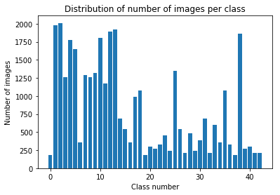
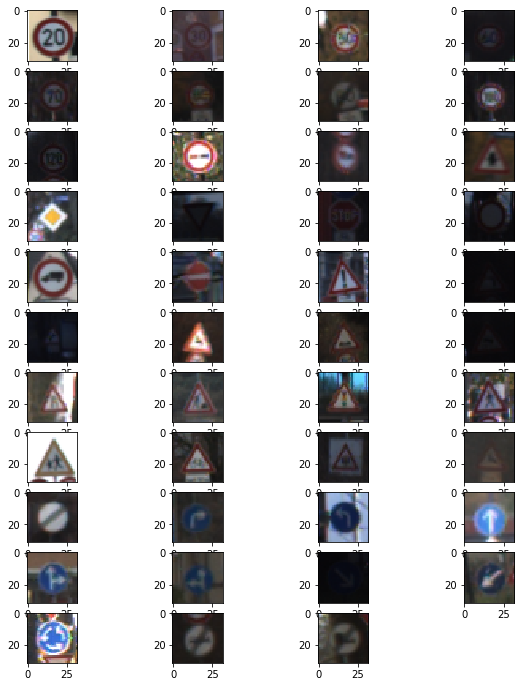
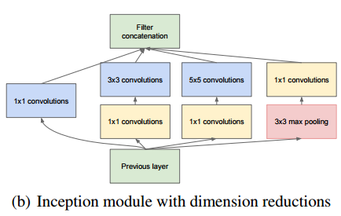
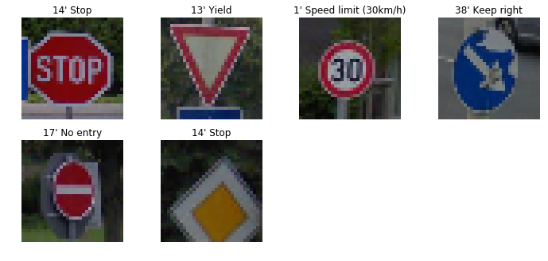
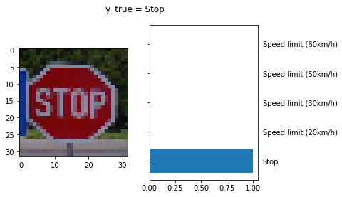
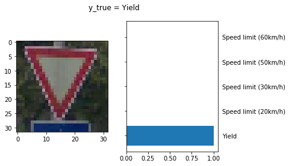
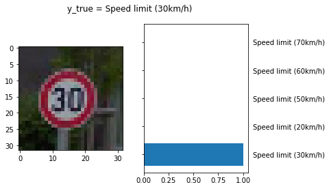
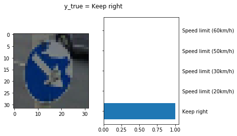
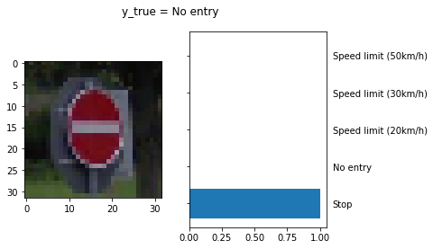
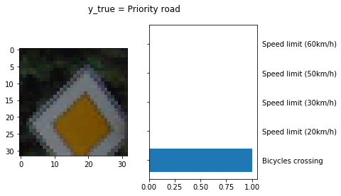

#**Traffic Sign Recognition** 

---

**Build a Traffic Sign Recognition Project**

The goals / steps of this project are the following:
* Load the data set (see below for links to the project data set)
* Explore, summarize and visualize the data set
* Design, train and test a model architecture
* Use the model to make predictions on new images
* Analyze the softmax probabilities of the new images
* Summarize the results with a written report

### Jupyter Notebook

* Source Code: [Traffic_Sign_Classifier.ipynb](./Traffic_Sign_Classifier.ipynb) 

### Data Set Summary & Exploration

#### Summary of the data set. 

* The size of training set is 34799
* The size of the validation set is 4410
* The size of test set is 12630
* The shape of a traffic sign image is (32, 32, 3)
* The number of unique classes/labels in the data set is 43

#### Exploratory visualization of the dataset.

Below bar chart shows the data distribution of the training data. Each bar represents one class (traffic sign) and how many samples are in the class. The mapping of traffic sign names to class id can be found here: [signnames.csv](./signnames.csv)

Below shows traffic sign example per class.

### Design and Test a Model Architecture

#### Preprocessing (data augmentation)

I kept the full colors of the images as I believe color plays an important role in image recognition, especially for traffic sign colors have meanings. Red means "warning", "don't" while blue can have neutral meaning.

Following steps are applied to this image preprocessing part:

1. Rotate image by random degrees in the range of -15 to 15 degrees. This is reasonable as in real world the traffic sign can be a bit off of its position.
2. Randomly scale images to account for image distortions.
3. Sharpen the images to make the edges clearer.
4. Crop images to remove unnecessary noises around the traffic signs.
5. Histogram equalization over Y channel of YCrCb color space to account for intensity unbalance.
6. Random brightness to add darker light effect or brighter light effect on the images. This is to mimic morning, noon, afternoon and evening. 
7. YUV normalization to normalize images over the three separate and independent components. Normalization makes the training faster and reduce the chance of getting stuck in local optima.

Here is an example of an original traffic sign image and its augmented version.

![alt text][augment.png]

#### Model Architecture
My model is inpired by GoogLeNet which consists inception module defined as the following picture: i

Below is the model architecture:

| Layer         		|     Description	        					| 
|:---------------------:|:---------------------------------------------:| 
| Input         		| 32x32x3 RGB image   							| 
| Convolution 1x1     	| 1x1 stride, same padding 	|
| Convolution 5x5     	| 1x1 stride, same padding 	|
| Inception layer     	| 	|
| Max pool layer 2x2    	| 2x2 stride, valid padding 	|
| Inception layer     	| 	|
| Max pool layer 3x3    	| 2x2 stride, valid padding 	|
| Convolution 1x1     	| 1x1 stride, same padding 	|
| Dropout					|				0.5								|
| Fully connected		|         									|
| Softmax				|         									|
 

#### Model Training

I trained the model on AWS g2.2xlarge instance. 

Here are my final training parameters:
* EPOCHS = 15
* BATCH_SIZE = 512
* SIGMA = 0.1
* OPIMIZER: AdamOptimizer (initial learning rate = 0.0005)

My results after training the model:
* Validation Accuracy = **96.89%**
* Test Accuracy = **81.6%**

#### Solution Approach

My initial number of epoches is 20, but the validation accuracy did not go up after 15 epoches so I reduced to 15 epoches. The initial data preprocessing does not include image normalization/random brightness/histogram equalization, and the validation accuracy is always below 92 no matter how many number of epoches I trained. After adding these data preprocessing methods, the validation accuracy exceeds 95 in the fourth epoch.

### Test on new images

#### Acquiring New Images

I googled German traffic signs and resized them to (32, 32, 3). Here are 6 examples I collected. 

#### Performance on New Images

| Image			        |     Prediction		| 
|:---------------------:|:---------------------:| 
| Speed limit (30km/h)  | Speed limit (30km/h)  | 
| Priority road   		| Stop 	|
| Yield			| Yield					|
| Stop		| Stop					|
| No entry		| No entry  |
| Keep right | Keep right |

accuracy = **83.3 %**

The accuracy 83.3 % is a bit higher than the accuracy of the test set (81.6 %)

#### Softmax Probabilities

**Prediction correct**

The model is very confident at predicting these images.

